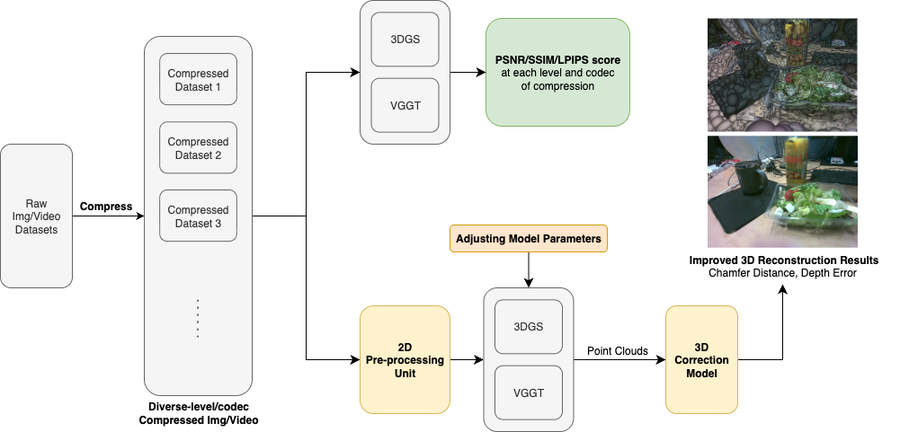
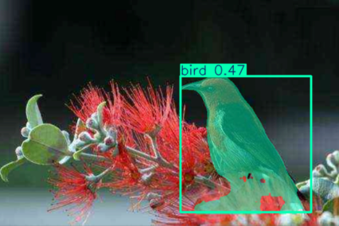
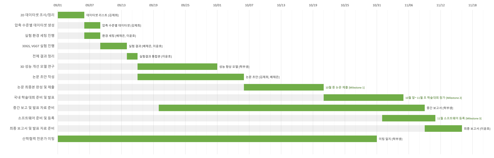

# 계획 발표

Status: In progress
Assignee: 윤호 이, 채은 배, 제희 김
Due date: 09/08/2025

# 1. 과제 목적 및 필요성

---

Computer vision task에서는 실시간 처리를 위해 영상압축이 필요하다.

그러나 널리 사용되는 JPEG, AVC, HEVC, VVC 같은 손실 압축 기법은 불가피하게 Ringing, Blocking 등 압축 아티팩트를 유발하고, 이는 vision task의 성능 저하로 이어질 수 있다. 

실제로 *Madhumitha et al., “Impact of Video Compression Artifacts on Fisheye Camera Visual Perception Tasks,” CVPRW 2024* 및 여러 논문에서는 2D 비전 과제에서 압축 아티팩트가 모델 성능에 미치는 부정적 영향이 실험적으로 확인되었다. 

예를 들어 YOLO(2D object detection) 모델에서의 confidence score 감소와 같은 문제가 있다.

<왼쪽이 JPEG quality 30으로 압축된 영상, 오른쪽이 원본 영상에 대한 YOLO model의 추론 결과, COCO dataset>

이러한 결과는 2D vision 문제에만 국한되지 않는다. 3D vision task 역시 대부분 다수의 2D image/video를 입력받기 때문에, 압축 아티팩트가 큰 성능 저하를 일으킬 가능성이 있다. 

특히 최근 각광받고 있는 3D Gaussian Splatting/VGGT(각각 CVPR 2023/2025 Best Paper) 와 같은 최신 3D Reconstruction 모델들은 입력에 매우 민감하기 때문에, 압축 아티팩트의 영향이 두드러질 수 있다.

## 배경 설명

3D scene reconstruction이란?

2D 이미지 속 장면을 컴퓨터가 이해할 수 있는 입체적인 3D 형태로 변환하는 기술

**3DGS**

- 여러 Multi-view 영상(이미지, 동영상)을 받아 그 장면을 수많은 3D Gaussian(반 투명 공)을 점묘화처럼 쌓아올려 3차원 장면을 표현하는 기술
- 복잡한 3D 공간도 빠르고 자연스럽게 화면에 렌더링 가능
- 3D Gaussian들의 조합이 어느 방향에서 보더라도 주어진 영상과 같아지도록 3D Gaussian들을 조정하는 과정을 반복
- 단점 : 깔끔한 렌더링을 위해선 많은 이미지가 필요함

**VGGT**

- 한 장 또는 여러 장의 이미지를 입력받아 카메라 파라미터, 포인트 맵, 깊이 맵, 3D 포인트 트랙 등 장면의 주요 3D 속성을 한 번의 feed-forward 연산으로 추론하는 신경망
- 후처리 없이 3D scene reconstruction을 1초 이내로 수행
- gpt처럼 특정 작업에 국한되지 않고 다양한 3D 작업에 재활용 가능한 범용 트랜스포머 기반 모델
- 단점 : 트랜스포머 기반 대규모 모델이기 때문에 입력 이미지가 많거나 고해상도일 경우 GPU 메모리와 연산 비용이 크게 증가함

따라서 본 연구에서는 2D input image/video의 압축 아티팩트가 3D Vision task의 inference에 미치는 영향을 위 두 모델을 사용하여 분석하고자 하며, 나아가 성능 저하를 완화하기 위한 새로운 방법을 제안하고자 한다.­

# 2. 과제 내용 및 추진 방법

---

## 1) 시스템 전체 구조도

## 2D Pre-processing Unit

1. **Denoising**: Median, Bilateral filter, DnCNN, BM3D 등 다양한 필터와 딥러닝 기반 기법으로 압축이나 촬영 과정에서 생긴 노이즈를 제거
    - Shah et al., “Comparative Analysis of Median Filter and Its Variants for Removal of Impulse Noise from Gray Scale Images,” 2022
    - Tomasi & Manduchi, “Bilateral Filtering for Gray and Color Images,” 1998
    - Zhang et al., “Beyond a Gaussian Denoiser: Residual Learning of Deep CNN for Image Denoising (DnCNN),” 2017
    - Jia et al., “Blind-noise Image Denoising with Block-matching Domain Transformation Filtering and Improved Guided Filtering,” 2022
2. **Super-resolution**: SwinIR, ESRGAN 등 초해상도 모델로 저해상도 또는 손상된 이미지를 고해상도로 복원하여, 더 정밀한 3D 복원이 가능하도록 함
    - Wang et al., “ESRGAN: Enhanced Super-Resolution Generative Adversarial Networks,” 2019
    - Liang et al., “SwinIR: Image Restoration Using Swin Transformer,” 2021

## 3D Correction Model

1. **Loss 최소화**: Depth Error, Chamfer Distance 등 오차 측정 지표를 이용해 복원 품질이 실제와 가까워지도록 최적화
    - Wu et al., “Density-aware Chamfer Distance as a Comprehensive Metric for Point Cloud Completion,” 2021
    - Hekmatian et al., “Conf-Net: Toward High-Confidence Dense 3D Point-Cloud with Error-Map Prediction,” 2019
2. **보정 전용 신경망**: PointNet, DGCNN 등 3D 점구름 데이터 전용 딥러닝 네트워크로, 3D 복원 결과를 더욱 정교하게 보정
    - Qi et al., “PointNet: Deep Learning on Point Sets for 3D Classification and Segmentation,” 2017
    - Wang et al., “Dynamic Graph CNN for Learning on Point Clouds,” 2019

## 2) 협업 툴

- Github - 코드 및 산출물 관리
- Slack - 소통
- Notion - 진행 상황 기록, 태스크 정리
- Zoom - 멘토님과 미팅
- Discord - 팀 회의

## 3) 개발 환경

**3DGS**

| 항목 | 내용 |
| --- | --- |
| OS | Ubuntu 22.04 / Windows 10 지원 (테스트됨) |
| GPU | NVIDIA RTX 3090 (24GB 이상 권장) / A6000 |
| CUDA/cuDNN | CUDA 11.8 (PyTorch와 호환 필요) |
| Python | 3.8 ~ 3.10 |
| Framework | PyTorch 2.0 이상, CUDA extensions |
| 필수 툴 | Conda, C++ Compiler (Visual Studio 2019 / g++), CMake 3.24 이상 |
| 기타 | COLMAP (SfM 변환), ImageMagick (리사이징), OpenGL 4.5 (Viewer 실행) |

**VGGT**

| 항목 | 내용 |
| --- | --- |
| OS | Ubuntu 20.04 / 22.04 (Linux 권장), Windows 11 지원 |
| GPU | NVIDIA Ampere 이상 (A100, RTX 3090/4090 등), VRAM 24GB 이상 권장 |
| CUDA/cuDNN | CUDA 11.8 이상, cuDNN 8.x |
| Python | 3.9 ~ 3.11 (테스트는 3.10 기준) |
| Framework | PyTorch 2.3.1, Torchvision 0.18.1 |
| 필수 툴 | Conda (환경 관리), CMake (일부 모듈 빌드), git |
| 기타 | HuggingFace Hub (모델 가중치 다운로드), FlashAttention v2/v3 (추론 가속), Gradio & Viser (데모/시각화), COLMAP (카메라 파라미터 연동) |

## 4) 기술 스택

**딥러닝 / 프레임워크**

- PyTorch: 두 모델(3DGS 최적화, VGGT Transformer) 학습/추론
- CUDA, FlashAttention: 대규모 연산 GPU 가속

**3D Reconstruction & Rendering**

- 3DGS : Sparse point cloud → Gaussian representation 변환, 실시간 3D 렌더링
- VGGT : 2D multi-view 입력 → depth, camera pose, 3D point 예측
- COLMAP: SfM 기반 카메라 캘리브레이션 및 sparse point cloud 생성

**데이터 전처리 & 압축**

- FFmpeg: 압축 코덱(AVC, HEVC) 변환 실험
- ImageMagick / OpenCV / Pillow: 이미지 리사이징 및 전처리

**실험 관리 & 실행 환경**

- Conda: 환경 격리 및 패키지 관리
- CMake: CUDA/OpenGL 모듈 빌드 (주로 3DGS Viewer)
- Gradio, Viser: 시각화 및 데모 인터페이스

**평가 지표**

- 2D 지표: PSNR, SSIM, LPIPS → 압축률/코덱 따른 화질 변화 평가
- 3D 지표: Chamfer Distance, Depth Error → 3D 재구성 성능 평가

## 5) 최종 목표

- 이미지 압축 코덱(JPEG, JPEG2000 등)과 영상 압축 코덱(AVC, HEVC 등)의 압축률이 3DGS 및 VGGT 성능에 미치는 영향을 체계적으로 검토한다.
- 압축으로 인해 발생하는 아티팩트(ringing, blocking 등)가 3D Scene Reconstruction 성능 (PSNR, SSIM, LPIPS 등의 정량적 지표)에 어떤 영향을 주는지 분석한다.
- 성능 저하를 완화할 수 있는 새로운 방법(전처리, 보정 모델, 학습 전략 등)을 적용하여 압축 환경에서도 원본에 준하는 품질의 3D 재구성 성능을 확보한다.
- 궁극적으로 압축 환경에 강건한 3D Vision 모델 설계의 기초 기반을 마련한다.

# 3. 과제 추진 일정

---

## 1) 세부 추진 일정

Milestone 1 : 논문 제출

Milestone 2 : 국내 학술대회 발표

Milestone 3 :  소프트웨어 등록

## 2) 회의 일정

- 팀 정기 회의: 매주 수요일 오후 6시, 대면
- 멘토 미팅: 매주 금요일 오후 6시, 비대면

# 4. 기대 효과 및 활용 방안

---

1. **강건한 모델 개발을 위한 기초 데이터 제공**
    
    압축률 및 코덱 변화에 따른 성능 변화를 정량적으로 제시함으로써, 3D Vision 연구자와 개발자가 압축 환경에서도 성능을 유지할 수 있는 모델을 설계하는 데 참고할 수 있는 근거 데이터를 제공할 수 있다.
    
2. **실사용 적합성 및 응용 분야 확장**
    
    본 연구는 고품질 원본 데이터를 확보하기 어려운 실제 환경(네트워크 제약, 저장 공간 제한 등)에서도 압축된 영상만으로 높은 품질의 3D Reconstruction을 수행할 수 있음을 입증한다. 
    
    또한 저대역폭 상황에서도 네트워크 비용을 절감하면서 3D 모델링 및 시각화 품질을 유지할 수 있다. 이를 통해 자율주행, 로보틱스, 보안 감시, XR(AR/VR) 등 다양한 응용 분야에서 실시간·저비용 환경에서도 고품질의 3D Scene Reconstruction을 구현할 수 있어, 산업적 활용도가 크게 향상된다.
    

---

# 계획 발표 피드백

**공통 피드백**

- 발표자는 스크립트 읽지 말 것, 준비하더라도 참고만 할 것
- 정기 회의(팀끼리, 멘토님 함께)날짜를 꼭 정해둘 것
- 멘토 미팅때 카메라 킬 것
- 시스템 구조도를 좀 더 디테일하게 만들 것
    - 외부 서버 등과의 연결을 상세히 기술할 것
    - 기술 스택들은 구조도 안에서 어떻게 사용하는지 표현할 것
- AI 모델 성능 평가는 지표를 확실히 정해야 함 + 정량적 목표까지 정해야 함
- 논문 2개 이상이면 확실하게 차별성이 있어야 함
- 목표 학회를 확실하게 정해서 날짜를 고정할 것
- 각 인원 별 기술적 역할을 확실히 할 것 (발표자료, 문서작업 X)
- 인원을 활용해서 시퀀설한 진행 보다는 병렬수행을 권장함
- 추후 과제란에 깃허브 URL, 계정 정보 업로드할 것
- 오늘 부족했던 점은 다음 발표 때 포함할 것

**다음 중간발표 1 : 요구 분석**

- Usecase dscription, diagram (중요)
- 기능적 요구, 비 기능적 요구 다 넣기